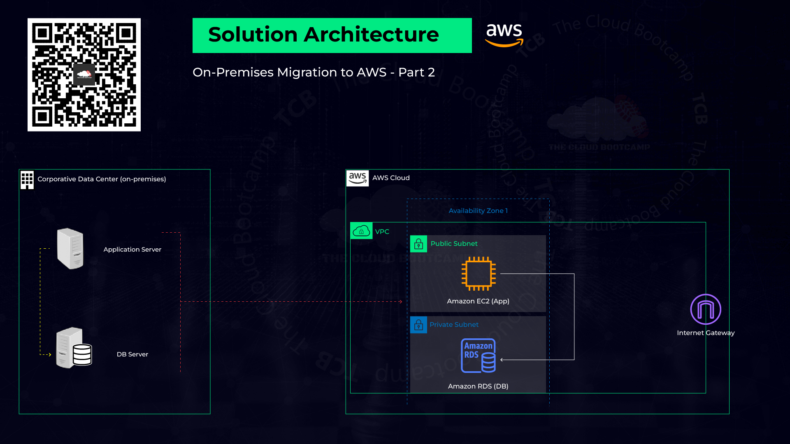
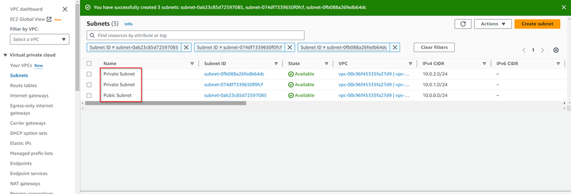

# Migrating a Corporate Data Center Workload to AWS: Leveraging Amazon EC2, VPC and RDS Services


**Project Description:**
In this real-world project, I assumed the role of a Cloud Specialist tasked with the migration of a critical workload from an on-premises Corporate DataCenter to Amazon Web Services (AWS). The project aimed to leverage the scalability, reliability, and cost-efficiency of AWS cloud infrastructure while ensuring a seamless transition without compromising data integrity or service availability.


**Project Approach:**
To ensure a successful migration, I followed a systematic approach with distinct phases:

**1. Planning:**
   - **Sizing:** Determined the appropriate AWS instance types and configurations to accommodate the workload's resource requirements.
   - **Prerequisites:** Ensured that all prerequisites, including network configurations and security policies, were in place for the migration.
   - **Resource Naming:** Established a clear and standardized naming convention for AWS resources to maintain consistency and manageability.

**2. Execution:**
   - **Resource Provisioning:** Set up the required AWS resources, including EC2 instances, RDS databases, VPCs, and security groups, adhering to AWS best practices.
   - **Best Practices:** Implemented AWS best practices for security, scalability, and high availability to optimize the performance of the migrated workload.

**3. Go-live:**
   - **Validation Test - Dry-run:** Conducted a dry-run of the migration process to identify potential issues and ensure a smooth transition. This step allowed us to address any challenges before the final migration.
   - **Final Migration - Cutover:** Executed the final migration, minimizing downtime and data transfer disruption. Monitored the process closely to guarantee data consistency.

**4. Post Go-live:**
   - **Operational Validation:** Performed thorough testing of the application to confirm its correct operation in the AWS environment.
   - **User Access:** Ensured seamless user access to the migrated workload and addressed any access-related issues promptly.

By meticulously following these migration steps, I achieved a successful migration of the workload to AWS, providing the organization with a scalable, reliable, and cost-effective cloud infrastructure. The project exemplified the importance of thorough planning, execution, and post-migration validation to mitigate risks and ensure a seamless transition to the cloud.
!

Now let's get down to it.

**Part 1: Deployment "Creating EC2 and RDS instance according to the 'sizing'"**

**step 1 Creating VPC and the Subnets**

*• VPC Only
• Name tag: vpc-bootcamp
• CIDR: 10.0.0.0/16 [ No Overlap with On-p ]*


**Creating Public and Privates Subnets**

The VPC and subnets are essential to provide network isolation and redundancy, ensuring high availability and security. This group of subnets allows us to deploy our RDS database within our VPC which requires and at least 2 subnets in multiple AZs for fault tolerance.

*• Name: Public Subnet
• AZ: us-east-1a
• CIDR: 10.0.0.0/24*

*• Name: Private Subnet
• AZ: us-east-1a
• CIDR: 10.0.1.0/24*

*• Name: Private Subnet
• AZ: us-east-1b
• CIDR: 10.0.2.0/24*





**Step 2 Creating EC2**

In this step I created an EC2 instance named *"awsuse1app01"* with an appropriate instance type. 
*• Name: awsuse1app01
• Ubuntu: 22.04 LTS
• Instance Type: t2.micro*

Next generate a keypair; *"ec2-ssh"* key pair and save the private key file securely that will be used for secure SSH connection to our EC2 instance. 


**Network Settings**

*VPC (vpc-bootcamp)
Subnet (Public Subnet)
Auto-assign public IP: Enable
Firewall (security groups): app01-sg [ Ports: 22 | 8080 ]*


**Step 3 Creating DB RDS**

The RDS instance will host our database securely in the AWS cloud, and proper configuration is essential for data integrity. such secure connectivity to it by not opening any connectivity to it from the public. 

*• RDS | Create database
• Standard create
• MySql | Version: MySql 5.7.'3x'  | Choose the major MySql 'v5.7.xx'  Keeping '5.7'
• Template: Free Tier

• DB instance identifier: awsuse1db01
• Credentials Settings: admin | admin123456
• DB instance class: db.t2.micro

(*) Don’t connect to an EC2 compute resource
• VPC: vpc-bootcamp
• VPC security group: let's keep the 'default' for while!
• AZ: us-east-1a
• Database port: 3306 (Additional configuration)*


**Part 2: Installing and Setting up the Packages and Libraries for the App and DB connection**

**Step 1 Connecting to the VM - EC2**

If you are working in a windows environment browse to the link below to install git bash  and install. 
https://git-scm.com/downloads


```console
ssh -i ec2-ssh ubuntu@ip-publico-ec2 
```

It'll not work, why?! You thought it right, there's no internet gateway to route our local connection to the VPC. In the next step we will create an internet gateway to make this happen. 

**Step 3 Creating an Internet Gateway, attaching it to a VPC and creating a Route**

*• VPC ---> Internet Gateway --> igw-mod3 -->Action: Attach to VPC (vpc-bootcamp)*


*Route Table -->  Routes --> Edit routes

Add route: 0.0.0.0/0 - Target: Internet Gateway (igw-mod3)*


our SSH connection should go through now. once done move over to the next step.

**Step 4 Instaling the application's dependencies**

We install various dependencies required for the application, including Python, Flask, and MySQL client libraries.

"Ubuntu 22.04" prompts ‘pop-ups’ after install/update packages requiring:

*“What service should be restarted?”*

By default this is set to "interactive" mode indicated by ‘i’  which causes the interruption of scripts.
To change this behavior to ‘a’. we can edit the `/etc/needrestart/needrestart.conf` file, changing lines:

From:
`#$nrconf{restart} = 'i';`
To:
`$nrconf{restart} = 'a';`

We can achieve this using the ‘sed’ command as shown below.

```console
sudo sed -i "/#\$nrconf{restart} = 'i';/s/.*/\$nrconf{restart} = 'a';/" /etc/needrestart/needrestart.conf
```
Once done check to see that changes have been effected using the command below.  

```console
cat /etc/needrestart/needrestart.conf | grep -i nrconf{restart}
```
Now we can go ahead and install the application depencies using the following commands without having our output interrupted.

```console
sudo apt update
sudo apt install python3-dev -y
sudo apt install python3-pip -y
sudo apt install build-essential libssl-dev libffi-dev -y
sudo apt install libmysqlclient-dev -y
sudo apt install unzip -y
sudo apt install libpq-dev libxml2-dev libxslt1-dev libldap2-dev -y
sudo apt install libsasl2-dev libffi-dev -y
pip3 install flask
export PATH=$PATH:/home/ubuntu/.local/bin/
```
These dependencies are crucial for running the application and connecting to the RDS database.

**Step 5 MySql Client Installation**

We install the MySQL client on the EC2 instance. MySQL client is neccessary for interracting with the database.

```console
pip3 install wtforms
sudo apt install pkg-config
pip3 install flask_mysqldb
pip3 install passlib
sudo apt-get install mysql-client -y
```

**Part 3: Go Live**

**Step 1 Creating a Security Group for RDS [ VPC | SG ]**

We create a security group ("EC2toRDS-sg") to allow the EC2 instance to access the RDS database on port 3306.
*Name: EC2toRDS-sg
Description: SG to allow access to MySQL by the application running at EC2.
VPC: vpc-bootcamp
Inbound rules -->  Add rule --> Type: MYSQL/Aurora  --> Destination: 0.0.0.0/0*


**Step 2 Associating the SG (EC2toRDS-sg) to the RDS instance (awsuse1db01):**

Associate the newly created security group with the RDS instance to allow traffic between them.

*RDS --> DB Instances --> awsuse1db01 -->Modify
Connectivity --> SG: EC2toRDS-sg
Continue... Apply immediately and "Modify DB instance"*


The step above ensures that the EC2 instance can communicate with the RDS database securely.


**Step 3 Connecting to the VM - EC2**

Before initiating the SSH connection we need to give our key the right permissions needed to connect using the following commands. 

```console
chmod 400 ec2-ssh 
ssh -i ec2-ssh ubuntu@ip-publico-ec2
```

windows users will need to go throug the following steps to prepare the key with the right permissions before connectin to the EC2 instance.

WARNING: UNPROTECTED PRIVATE KEY FILE!

*Select 'ec2-ssh.pem' file -> Right Click -> Properties
Security > Advanced > Change the "Owner" to your user.
"Disable inheritance" --> 'Convert inherited permissions into explicit permissions'
Add > Select a Principal --> Add your user
Remove all other Objects/Users*

**Step 4 Downloading the Aplication and the 'Dump' files:**

We download the application and the database dump files to the EC2 instance.

```console
wget https://aws-mod3.s3.amazonaws.com/wikiapp.zip
wget https://aws-mod3.s3.amazonaws.com/dump.sql
```


**Step 5 Connecting to the MySQL server (AWS RDS)**

Copy the Endpoint of your RDS and replace it below

```console
mysql -h <rds_endpoint> -P 3306 -u admin -p
```

*EXAMPLE: mysql -h awsuse1db01.culdx6558fqq.us-east-1.rds.amazonaws.com -P 3306 -u admin -p*

 *Password: admin123456*

 password is configures in the database dump file. 
 


**Step 6 Creating a DB 'wikidb' and importing data to it.** 

This ensures the application has the required data for operation.

```console
show databases;
create database wikidb;
show databases;
use wikidb;
show tables;
source dump.sql;
show tables;
select * from articles;
```

**Step 7 Creating an user 'wiki' in the "wikidb"**

We create a user named *"wiki"* with appropriate privileges on the *"wikidb"* database.

```console
CREATE USER wiki@'%' IDENTIFIED BY 'admin123456';
GRANT ALL PRIVILEGES ON wikidb.* TO wiki@'%';
FLUSH PRIVILEGES;
EXIT;
```
**Step 8 Unziping the application's file and edit the wiki.py file.** 

We unzip the application file and edit the *"wiki.py"* configuration to specify the MySQL host and user.

```console
unzip wikiapp.zip
cd wikiapp/
vi wiki.py
```

`session '# Config MySQL'
'MYSQL_HOST' = 'awsuse1db01.cfhprbugweo6.us-east-1.rds.amazonaws.com' [EXAMPLE]
'MYSQL_USER' = 'wiki'`

Configuring the application correctly ensures it connects to the RDS database.


**Step 9 Loading the application:**

let's launch our application and make it accessible through the web using the following command. 

```console
python3 wiki.py
```

Validate the migration by copying the Public IP of your EC2 instance and add to it the port "8080": and login with credentials configured in the database.

*<PUBLIC_IP_OF_YOUR_EC2>:8080*
*Login: admin / ***** *

**Ste 10 Test the application by adding a new Article:**

we test out out application by creating a new article title *"Let's conquer the cloud universal"* and the following contents

*"I'm conquering the MultiCloud Universe and my name is [ENTER YOUR NAME HERE]! 😎
Let's learn together from The Cloud Bootcamp's MultiCloud Bootcamp! 🔥🚀"*


A successful creation of this article indicate that our deployment went on successfully.


Congratulations! You've successfully migrated an enterprise workload to AWS, demonstrating the step-by-step process and rationale for each action.

